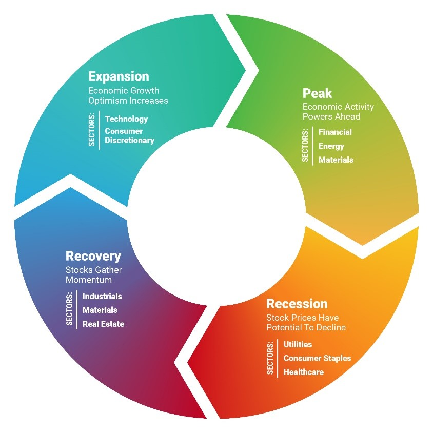

# Introduction to Stocks
## BusinessCircle 
<!--  -->
- Expansion: low interest rate>expand 
- Peak: natural interest rate increase, inverted yield curve
- Recession: consecutive quarters of decline GDP
- **Depression**: Consumers won’t borrow nor spend because they are pessimistic about the outlook. 
- Recovery: Start increase hire

# Intro to Future
- Contango:Future price> current
- Backwardation: <

# FX
- trade balance
- requirements of its goods and service
- its foreign investment activity
- political climate
- monetory and Fiscal policy

# Order type

## stop order
momentum chasing
Sell Stop (Stop-Loss): You own a stock, and you want to sell it if the price falls to a certain level to prevent further losses.
Example: Stock is at $100. You place a Sell Stop Order at $90. This order does nothing as long as the price is above $90. It's an inactive instruction sitting on your broker's server. Only if the price drops to $90 does it trigger the order to sell.
### stop limit order
triggered to set limit order
## midprice order
designed to minimize costs, and capturing half the spread is a core part of their strategy.
## market to limit order
excute the current market price, if only partially filled, the remainder will be re-submmit as limit orders.
## Market if touched

| | |  |     
| ----------- | ----------- | ----------- |     
| Buy Stop Order | Enter a long position on a breakout | Above the current price |   
| Buy Market-if-Touched Order | Enter a long position on a price dip. |	Below the current price. |

# Monetary
## M2 supply
Money Supply ↑ → Domestic Interest Rates ↓ (liquidity effect)
When a central bank increases the money supply (e.g., by buying government bonds, lowering reserve requirements, or cutting its policy rate), it injects more liquidity into the financial system. This increased supply of loanable funds typically leads to a decrease in interest rates in the short term. Lenders have more money to lend, making them more willing to offer lower rates to attract borrowers.
Quantity Theory: MV = PQ

# Key Economic Events
## Non Farm Payroll Payment
8:30 a.m. Eastern Time on the first Friday of every month.
Strong NFP (Low Unemployment, Rising Wages): Can suggest an overheating economy and potential inflationary pressures. The Fed might consider raising interest rates to cool down the economy and control inflation.

Weak NFP (High Unemployment, Stagnant Wages): Might indicate economic weakness or a potential recession. The Fed could consider lowering interest rates or implementing other easing measures to stimulate growth. The Fed has a dual mandate of maximizing employment and maintaining stable prices, so the NFP report is directly tied to both.
## PPI CPI
(FOMC) implements monetary policy to help maintain inflation rates of somewhere around 2% over the medium term. If the PPI or CPI numbers remain above this level, the Fed can deem it to be threatening to the economy. This could lead the FOMC to increase interest rates in order to rein in rising prices. On the other hand, an extended period of low or negative inflation means the central bank would consider actions that would stimulate the economy such as cutting interest rates or embarking on Quantitative Easing (QE).
## CCI
Publisher: In the United States, the most prominent CCI is published monthly by The Conference Board, a private research organization.

# Momentom
## Oscillator
Relative Strength Index (RSI): Calculates the average gain over a period divided by the average loss over the same period, then normalizes it to a scale of 0 to 100.

Stochastic Oscillator: Compares a security's closing price to its price range over a given period, also typically normalized to a scale of 0 to 100.
Not Always Accurate in Strong Trends: In very strong, sustained trends (either up or down), oscillators can remain in overbought or oversold territory for extended periods without a significant reversal. This is why they are often best used in conjunction with trend-following indicators or in ranging markets.

On-Balance Volume (OBV):
Concept: Developed by Joe Granville, OBV is a momentum indicator that relates volume to price change. It's a running total of positive and negative volume.

Calculation (Simplified):
If the current closing price is higher than the previous closing price, the current day's volume is added to the previous OBV total.
If the current closing price is lower than the previous closing price, the current day's volume is subtracted from the previous OBV total.
If the closing price is unchanged, the OBV remains the same.

Divergence: This is where OBV can be particularly powerful.

Bullish Divergence: If the stock's price makes a lower low, but OBV makes a higher low (or fails to make a new low), it suggests that selling pressure is actually weakening despite the price drop. This could signal a potential upward reversal.

Bearish Divergence: If the stock's price makes a higher high, but OBV makes a lower high (or fails to make a new high), it suggests that buying pressure is weakening despite the price rise. This could signal a potential downward reversal.