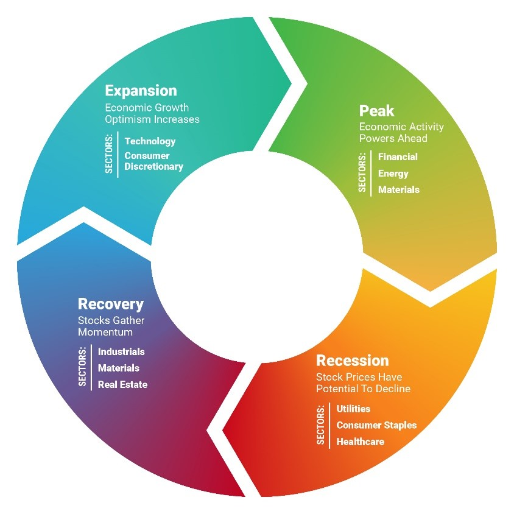

# Introduction to Stocks
## BusinessCircle 
<!--  -->
- Expansion: low interest rate>expand 
- Peak: natural interest rate increase, inverted yield curve
- Recession: consecutive quarters of decline GDP
- **Depression**: Consumers won’t borrow nor spend because they are pessimistic about the outlook. 
- Recovery: Start increase hire

# Intro to Future
- Contango:Future price> current
- Backwardation: <

# FX
- trade balance
- requirements of its goods and service
- its foreign investment activity
- political climate
- monetory and Fiscal policy

# Order type

## stop order
momentum chasing
Sell Stop (Stop-Loss): You own a stock, and you want to sell it if the price falls to a certain level to prevent further losses.
Example: Stock is at $100. You place a Sell Stop Order at $90. This order does nothing as long as the price is above $90. It's an inactive instruction sitting on your broker's server. Only if the price drops to $90 does it trigger the order to sell.
### stop limit order
triggered to set limit order
## midprice order
designed to minimize costs, and capturing half the spread is a core part of their strategy.
## market to limit order
excute the current market price, if only partially filled, the remainder will be re-submmit as limit orders.
## Market if touched

| | |  |     
| ----------- | ----------- | ----------- |     
| Buy Stop Order | Enter a long position on a breakout | Above the current price |   
| Buy Market-if-Touched Order | Enter a long position on a price dip. |	Below the current price. |

